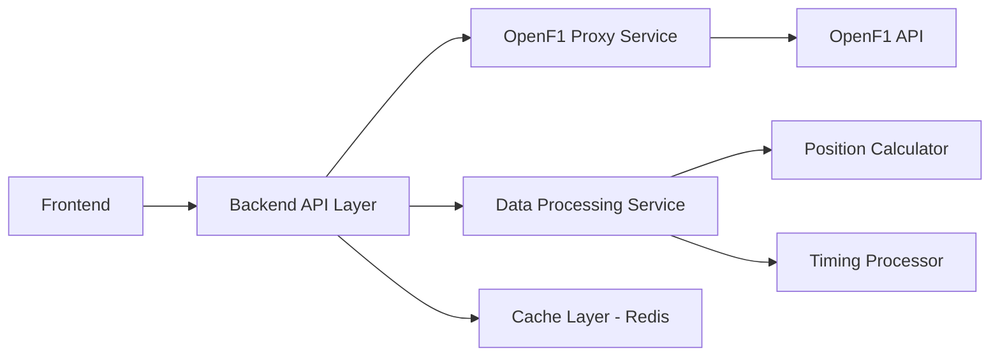

# F1 Replay API Specification

F1 Global Tour의 리플레이 모드에서 필요한 백엔드 API 명세서입니다. OpenF1 API를 기반으로 한 실제 백엔드 구현을 위한 완전한 가이드입니다.

## 목차
- [개요](#개요)
- [백엔드 아키텍처](#백엔드-아키텍처)
- [기술 스택](#기술-스택)
- [인증](#인증)
- [공통 응답 형식](#공통-응답-형식)
- [세션 관리 API](#세션-관리-api)
- [드라이버 정보 API](#드라이버-정보-api)
- [타이어 전략 API (Stints)](#타이어-전략-api-stints)
- [드라이버 타이밍 API](#드라이버-타이밍-api)
- [텔레메트리 데이터 API](#텔레메트리-데이터-api)
- [플래그 상태 API](#플래그-상태-api)
- [실시간 업데이트 API](#실시간-업데이트-api)
- [데이터 변환 로직](#데이터-변환-로직)
- [캐싱 전략](#캐싱-전략)
- [에러 처리](#에러-처리)
- [데이터 모델](#데이터-모델)

## 개요

F1 리플레이 시스템은 실제 F1 레이스의 역사적 데이터를 시간 순서대로 재생하는 기능입니다. **OpenF1 API**를 직접 활용하여 실제 F1 데이터를 가져오고, 프론트엔드 요구사항에 맞게 가공하여 제공합니다.

### 기술 요구사항
- **OpenF1 API 프록시**: 실제 F1 데이터 소스 활용
- **RESTful API 설계**: 표준 HTTP 메서드 사용
- **WebSocket 지원**: 실시간 데이터 스트리밍 (선택적)
- **캐싱 시스템**: Redis 기반 고성능 데이터 캐싱
- **CORS 지원**: 개발환경(localhost:3000) 및 프로덕션 도메인
- **JSON 데이터 형식**: OpenF1 호환 + 프론트엔드 최적화
- **4초 간격 업데이트**: OpenF1 intervals API 주기와 동일

## 백엔드 아키텍처

### 서비스 레이어 구조


### 핵심 처리 방식
1. **리얼타임이 아닌 히스토리 데이터**: 사용자가 세션 선택시 해당 세션의 전체 데이터를 백엔드에서 캐싱
2. **OpenF1 API 장애 처리**: API 불가시 프론트엔드에 에러 메시지 전달 후 리플레이 모드 종료
3. **데이터 프록시 역할**: OpenF1 API 응답을 가져와 필요한 정보만 필터링하여 프론트엔드로 전달

## 기술 스택

### 백엔드 핵심 스택
- **Runtime**: Node.js 22+ (비동기 처리 최적화)
- **Framework**: NestJS + TypeScript (모듈화, 타입 안전성)
- **Database**: PostgreSQL (메타데이터) + Redis (캐싱/실시간)
- **API Client**: Axios (OpenF1 API 호출)
- **실시간 처리**: Socket.io (WebSocket) + BullMQ (큐 처리)
- **코드 품질**: ESLint + Prettier
- **테스트**: Jest

### 공유 타입 시스템
- **프론트엔드와 타입 공유**: `@f1-tour/shared-types` 패키지 활용
- **OpenF1 타입 정의**: 실제 API 응답 구조 기반 TypeScript 인터페이스

## 인증

현재 구현에서는 별도 인증이 없으나, 실제 서비스에서는 API 키 기반 인증을 권장합니다.

```http
Authorization: Bearer {api_key}
```

## 공통 응답 형식

### 성공 응답
```json
{
  "success": true,
  "data": {},
  "timestamp": "2024-03-15T10:30:00.000Z"
}
```

### 에러 응답
```json
{
  "success": false,
  "error": {
    "code": "ERROR_CODE",
    "message": "Human readable error message",
    "details": {}
  },
  "timestamp": "2024-03-15T10:30:00.000Z"
}
```

## 세션 관리 API

### 1. 사용 가능한 세션 목록 조회

**OpenF1 소스**: `GET https://api.openf1.org/v1/sessions?country_name={country}&year={year}`

**Backend Endpoint**: `GET /api/v1/sessions`

**Query Parameters**:
- `country` (optional): 국가명 필터 (예: Belgium)
- `year` (optional): 연도 필터 (예: 2023)

**응답** (OpenF1 기반 + 추가 가공):
```json
{
  "success": true,
  "data": [
    {
      "meeting_key": 1216,
      "session_key": 9134,
      "session_name": "Practice 1",
      "session_type": "Practice", 
      "location": "Spa-Francorchamps",
      "circuit_short_name": "Spa-Francorchamps",
      "country_name": "Belgium",
      "country_code": "BEL",
      "date_start": "2023-07-28T11:30:00+00:00",
      "date_end": "2023-07-28T12:30:00+00:00",
      "year": 2023
    }
  ],
  "timestamp": "2024-03-15T10:30:00.000Z"
}
```

### 2. 특정 세션의 드라이버 정보 조회

**OpenF1 소스**: `GET https://api.openf1.org/v1/drivers?session_key={sessionKey}`

**Backend Endpoint**: `GET /api/v1/sessions/{sessionKey}/drivers`

**응답** (OpenF1 원본):
```json
{
  "success": true,
  "data": [
    {
      "meeting_key": 1219,
      "session_key": 9158,
      "driver_number": 1,
      "full_name": "Max VERSTAPPEN",
      "name_acronym": "VER",
      "team_name": "Red Bull Racing",
      "team_colour": "3671C6"
    }
  ],
  "timestamp": "2024-03-15T10:30:00.000Z"
}
```

### 3. 세션 리플레이 시작 (캐싱 트리거)

**Backend Endpoint**: `POST /api/v1/sessions/{sessionKey}/start-replay`

**기능**: 선택된 세션의 전체 데이터를 백엔드에서 미리 캐싱
- OpenF1에서 해당 세션의 모든 필요 데이터 수집
- Redis 캐시에 저장하여 빠른 응답 준비
- 프론트엔드에 캐싱 완료 응답

**응답**:
```json
{
  "success": true,
  "data": {
    "sessionKey": 9158,
    "cachingStatus": "completed",
    "availableData": ["drivers", "laps", "intervals", "car_data", "race_control"]
  },
  "timestamp": "2024-03-15T10:30:00.000Z"
}
```

## 드라이버 정보 API

### 드라이버 목록 및 상세 정보

**OpenF1 소스**: `GET https://api.openf1.org/v1/drivers?session_key={sessionKey}`

**Backend Endpoints**:
- `GET /api/v1/drivers/session/{sessionKey}` - 세션의 모든 드라이버 목록
- `GET /api/v1/drivers/session/{sessionKey}/driver/{driverNumber}/info` - 특정 드라이버 상세 정보
- `GET /api/v1/drivers/session/{sessionKey}/driver/{driverNumber}/telemetry` - 특정 드라이버 텔레메트리 (dateStart, dateEnd 쿼리 파라미터)
- `GET /api/v1/drivers/session/{sessionKey}/driver/{driverNumber}/laps` - 특정 드라이버 랩 데이터 (lapNumber 쿼리 파라미터로 필터 가능)

**매개변수**:
- `sessionKey` (required): 세션 식별자
- `driverNumber` (optional): 드라이버 번호
- `dateStart`, `dateEnd` (optional): 시간 범위 필터
- `lapNumber` (optional): 특정 랩 필터

## 타이어 전략 API (Stints)

### 타이어 전략 및 피트스톱 정보

**OpenF1 소스**: `GET https://api.openf1.org/v1/stints?session_key={sessionKey}`

**Backend Endpoints**:
- `GET /api/v1/stints/session/{sessionKey}` - 세션의 모든 스틴트 정보
- `GET /api/v1/stints/session/{sessionKey}/driver/{driverNumber}` - 특정 드라이버 스틴트 정보
- `GET /api/v1/stints/session/{sessionKey}/tire-strategy` - 타이어 전략 분석
- `GET /api/v1/stints/session/{sessionKey}/pit-stops` - 피트스톱 정보 (driverNumber 쿼리 파라미터로 필터 가능)
- `GET /api/v1/stints/session/{sessionKey}/tire-performance` - 타이어 성능 분석 (compound 쿼리 파라미터로 필터 가능)
- `GET /api/v1/stints/session/{sessionKey}/stint-comparison?driver1={num1}&driver2={num2}` - 드라이버 간 스틴트 비교
- `GET /api/v1/stints/session/{sessionKey}/tire-degradation` - 타이어 마모 분석 (driverNumber 쿼리 파라미터로 필터 가능)

**매개변수**:
- `sessionKey` (required): 세션 식별자
- `driverNumber` (optional): 특정 드라이버 필터
- `compound` (optional): 타이어 컴파운드 필터 (SOFT, MEDIUM, HARD, INTERMEDIATE, WET)
- `driver1`, `driver2` (required for comparison): 비교할 드라이버 번호들

## 드라이버 타이밍 API

### 1. 드라이버 인터벌 정보 (4초 간격 업데이트)

**OpenF1 소스**: `GET https://api.openf1.org/v1/intervals?session_key={sessionKey}`

**Backend Endpoint**: `GET /api/v1/intervals/session/{sessionKey}`

**매개변수**:
- `sessionKey` (required): 세션 식별자
- `date` (optional): 특정 시점 데이터 조회

**주요 특징**: OpenF1 intervals API는 레이스 중에만 사용 가능하며, 약 4초마다 업데이트됩니다.

**추가 엔드포인트**:
- `GET /api/v1/intervals/session/{sessionKey}/live` - 최신 실시간 인터벌
- `GET /api/v1/intervals/session/{sessionKey}/standings` - 현재 순위
- `GET /api/v1/intervals/session/{sessionKey}/driver/{driverNumber}/gaps` - 특정 드라이버 갭 정보
- `GET /api/v1/intervals/session/{sessionKey}/history` - 인터벌 히스토리 (startDate, endDate 쿼리 파라미터)

**응답**:
```json
{
  "success": true,
  "data": {
    "currentLap": 1,
    "totalLaps": 78,
    "timings": [
      {
        "position": 1,
        "driverCode": "VER",
        "driverNumber": 1,
        "teamColor": "#3671C6",
        "interval": "--",
        "intervalToAhead": "",
        "gapToLeader": 0,
        "currentLapTime": "1:12.456",
        "bestLapTime": "1:12.456",
        "lastLapTime": "1:12.456",
        "miniSector": {
          "sector1": "fastest",
          "sector2": "personal_best", 
          "sector3": "normal"
        },
        "sectorTimes": {
          "sector1": 14.123,
          "sector2": 37.789,
          "sector3": 20.544
        },
        "tireInfo": {
          "compound": "SOFT",
          "age": 1,
          "pitStops": 0
        },
        "speeds": {
          "i1Speed": 185.5,
          "i2Speed": 190.2,
          "stSpeed": 195.8
        },
        "isRetired": false,
        "retiredReason": null
      }
    ]
  }
}
```

### 2. 랩 데이터 API

**OpenF1 소스**: `GET https://api.openf1.org/v1/laps?session_key={sessionKey}&lap_number={lapNumber}`

**Backend Endpoints**:
- `GET /api/v1/laps/session/{sessionKey}` - 세션의 모든 랩 조회 (lapNumber 쿼리 파라미터로 필터 가능)
- `GET /api/v1/laps/session/{sessionKey}/lap/{lapNumber}` - 특정 랩 상세 조회
- `GET /api/v1/laps/session/{sessionKey}/driver/{driverNumber}` - 특정 드라이버의 랩 데이터 (lapNumber 쿼리 파라미터로 필터 가능)
- `GET /api/v1/laps/session/{sessionKey}/fastest` - 가장 빠른 랩들 조회 (limit 쿼리 파라미터)
- `GET /api/v1/laps/session/{sessionKey}/analysis` - 랩 분석 데이터

**매개변수**:
- `sessionKey` (required): 세션 식별자
- `lapNumber` (optional): 조회할 랩 번호
- `driverNumber` (optional): 드라이버 번호
- `limit` (optional): 결과 제한

**주요 특징**: 랩 완주시에만 데이터 제공, segments 데이터로 미니섹터 성능 계산 가능

**응답**:
```json
{
  "success": true,
  "data": {
    "driverNumber": 1,
    "nameAcronym": "VER",
    "fullName": "Max Verstappen",
    "teamName": "Red Bull Racing",
    "teamColor": "#3671C6",
    "currentLap": 1,
    "position": 1,
    "lapHistory": [
      {
        "lapNumber": 1,
        "lapTime": 72.456,
        "sectorTimes": [14.123, 37.789, 20.544],
        "position": 1,
        "tireCompound": "SOFT",
        "isPitLap": false
      }
    ],
    "bestLap": {
      "lapNumber": 1,
      "lapTime": 72.456,
      "sectorTimes": [14.123, 37.789, 20.544]
    },
    "pitStops": [],
    "penalties": [],
    "isRetired": false,
    "retiredLap": null,
    "retiredReason": null
  }
}
```

## 텔레메트리 데이터 API

### 1. 드라이버 텔레메트리 데이터

**OpenF1 소스**: `GET https://api.openf1.org/v1/car_data?driver_number={driverNumber}&session_key={sessionKey}`

**Backend Endpoints**:
- `GET /api/v1/car-data/session/{sessionKey}/driver/{driverNumber}` - 특정 드라이버 텔레메트리
- `GET /api/v1/car-data/session/{sessionKey}/telemetry` - 세션 전체 텔레메트리 (drivers 쿼리 파라미터로 필터 가능)
- `GET /api/v1/car-data/session/{sessionKey}/driver/{driverNumber}/speed-analysis` - 속도 분석
- `GET /api/v1/car-data/session/{sessionKey}/driver/{driverNumber}/gear-analysis` - 기어 분석
- `GET /api/v1/car-data/session/{sessionKey}/driver/{driverNumber}/drs-usage` - DRS 사용 분석
- `GET /api/v1/car-data/session/{sessionKey}/comparison?driver1={num1}&driver2={num2}` - 드라이버 비교

**매개변수**:
- `sessionKey` (required): 세션 식별자
- `driverNumber` (required/optional): 드라이버 번호
- `date` (optional): 특정 시점 데이터 조회
- `drivers` (optional): 쉼표로 구분된 드라이버 번호 목록 (예: "1,16,44")
- `driver1`, `driver2` (required for comparison): 비교할 드라이버 번호들

**주요 특징**: 약 3.7Hz 샘플링 레이트, DRS 값은 FastF1 해석 테이블 참조

**응답**:
```json
{
  "success": true,
  "data": {
    "driverNumber": 1,
    "nameAcronym": "VER",
    "teamColor": "#3671C6",
    "telemetry": {
      "speed": 285.5,
      "gear": 7,
      "throttle": 85.2,
      "brake": 0.0,
      "drs": {
        "enabled": true,
        "available": true
      }
    },
    "timestamp": "2024-03-15T10:30:00.250Z"
  }
}
```


## 플래그 상태 API

### 1. 레이스 컨트롤 및 플래그 정보

**OpenF1 소스**: `GET https://api.openf1.org/v1/race_control?session_key={sessionKey}`

**Backend Endpoints**:
- `GET /api/v1/race-control/session/{sessionKey}` - 레이스 컨트롤 전체 정보
- `GET /api/v1/race-control/session/{sessionKey}/flags` - 플래그 정보
- `GET /api/v1/race-control/session/{sessionKey}/incidents` - 사고 정보
- `GET /api/v1/race-control/session/{sessionKey}/safety-car` - 세이프티카 기간 정보
- `GET /api/v1/race-control/session/{sessionKey}/timeline` - 레이스 타임라인 (startDate, endDate 쿼리 파라미터)
- `GET /api/v1/race-control/session/{sessionKey}/penalties` - 페널티 정보 (driverNumber 쿼리 파라미터로 필터 가능)
- `GET /api/v1/race-control/session/{sessionKey}/drs-zones` - DRS 구역 정보

**매개변수**:
- `sessionKey` (required): 세션 식별자
- `date` (optional): 특정 시점 데이터 조회
- `driverNumber` (optional): 특정 드라이버 필터
- `startDate`, `endDate` (optional): 시간 범위 필터

**필터링 대상**: VSC, SC, RED FLAG 관련 메시지만 프론트엔드로 전달

**주요 메시지 타입**:
- `VIRTUAL SAFETY CAR DEPLOYED` / `VIRTUAL SAFETY CAR ENDING`
- `SAFETY CAR DEPLOYED` / `SAFETY CAR IN THIS LAP`
- `RED FLAG` / `TRACK CLEAR`

**응답**:
```json
{
  "success": true,
  "data": {
    "currentLap": 1,
    "totalLaps": 78,
    "sessionType": "RACE",
    "currentFlag": "GREEN",
    "flagHistory": {
      "lapFlags": ["GREEN", "GREEN", "SC", "SC", "GREEN"],
      "timeFlags": [
        {
          "lapNumber": 3,
          "flagType": "SC",
          "startTime": "2024-03-15T10:35:00.000Z",
          "endTime": "2024-03-15T10:38:00.000Z",
          "reason": "Debris on track"
        }
      ]
    },
    "upcomingFlags": [
      {
        "lapNumber": 5,
        "flagType": "VSC",
        "reason": "Car recovery"
      }
    ]
  }
}
```


## 실시간 업데이트 API

### WebSocket 연결 (선택적)

**Endpoint**: `ws://localhost:4000/ws/replay/{sessionKey}`

**참고**: 기본적으로 4초 간격 HTTP 폴링 방식 사용, WebSocket은 더 부드러운 실시간성이 필요한 경우에만 구현

**연결 메시지**:
```json
{
  "type": "subscribe",
  "sessionKey": 9161,
  "startLap": 1
}
```

**실시간 데이터 스트림**:
```json
{
  "type": "timing_update",
  "sessionKey": 9161,
  "currentLap": 1,
  "timestamp": "2024-03-15T10:30:00.000Z",
  "timings": [
    // 드라이버 타이밍 배열 (위와 동일한 구조)
  ]
}
```

**텔레메트리 업데이트**:
```json
{
  "type": "telemetry_update", 
  "sessionKey": 9161,
  "currentLap": 1,
  "timestamp": "2024-03-15T10:30:00.000Z",
  "telemetryData": [
    {
      "driverNumber": 1,
      "speed": 285.5,
      "gear": 7,
      "throttle": 85.2,
      "brake": 0.0,
      "drsEnabled": true,
      "drsAvailable": true
    }
  ]
}
```

**플래그 상태 변경**:
```json
{
  "type": "flag_update",
  "sessionKey": 9161, 
  "currentLap": 3,
  "timestamp": "2024-03-15T10:35:00.000Z",
  "flagData": {
    "currentFlag": "SC",
    "previousFlag": "GREEN",
    "reason": "Debris on track",
    "sector": 2
  }
}
```

**랩 변경 알림**:
```json
{
  "type": "lap_change",
  "sessionKey": 9161,
  "newLap": 2,
  "timestamp": "2024-03-15T10:30:00.000Z"
}
```

**세션 완료 알림**:
```json
{
  "type": "session_complete",
  "sessionKey": 9161,
  "finalResults": [
    // 최종 순위 데이터
  ]
}
```

## 데이터 변환 로직

### OpenF1 → Frontend 데이터 매핑

#### 1. Intervals → DriverTiming
```typescript
// OpenF1 intervals 데이터를 프론트엔드 DriverTiming 형식으로 변환
const convertIntervalsToDriverTiming = (intervals: OpenF1Interval[], laps: OpenF1Lap[]) => {
  // interval: "0.003" → intervalToAhead 계산
  // gap_to_leader → gapToLeader 직접 매핑
  // position 정보는 interval 순서로 계산
};
```

#### 2. Car Data → Telemetry
```typescript
// OpenF1 car_data를 텔레메트리로 변환
const convertCarDataToTelemetry = (carData: OpenF1CarData[]) => {
  // DRS 변환 (F1TransformationsUtil.transformDRS 사용):
  // - drs: 0, 1 → { enabled: false, available: false }
  // - drs: 8 → { enabled: false, available: true }
  // - drs: 10, 12, 14 → { enabled: true, available: true }
  // - throttle, brake 값 직접 매핑
  // - gear (n_gear), speed, rpm 직접 매핑
};

// 실제 구현은 F1TransformationsUtil.transformCarData() 사용
```

#### 3. Segments → MiniSector Performance
```typescript
// OpenF1 segments를 미니섹터 성능으로 변환
const convertSegmentsToMiniSector = (segments: number[]) => {
  // 0 → "neutral" (not available)
  // 2048 → "neutral" (yellow sector)
  // 2049 → "best" (green sector)
  // 2051 → "personal_best" (purple sector)
  // 2064 → "pit" (pit lane)
};

// 실제 구현은 F1TransformationsUtil.transformSegments() 사용
// 반환 타입: SectorPerformance = 'personal_best' | 'best' | 'neutral' | 'pit'
```

#### 4. Stints → TireInfo
```typescript
// OpenF1 stints를 타이어 정보로 변환
const convertStintsToTireInfo = (stints: OpenF1Stint[], currentLap: number) => {
  // lap_start와 currentLap 비교하여 현재 타이어 컴파운드 결정
  // stint_number로 피트스톱 횟수 계산
};
```

### 특수 처리 로직
- **DNF 처리**: `lap_duration`이 null인 경우 리타이어 처리
- **Pit Lane**: segments에서 2064 값 발견시 "in pit" 상태 처리
- **Circuit Mapping**: OpenF1 circuit_short_name을 프론트엔드 circuit ID로 매핑

## 캐싱 전략

### Redis 캐시 레이어
```typescript
const CACHE_STRATEGY = {
  // 변경되지 않는 데이터 - 장기간 캐싱
  sessions: 3600,          // 세션 메타데이터 (1시간)
  drivers: 1800,           // 드라이버 목록 (30분)
  stints: 1800,            // 타이어 전략 (30분)

  // 실시간/준실시간 데이터 - 단기간 캐싱
  laps: 900,               // 랩 데이터 (15분)
  intervals: 300,          // 드라이버 인터벌 (5분)
  carData: 600,            // 텔레메트리 데이터 (10분)
  raceControl: 300,        // 플래그/레이스 컨트롤 (5분)
};
```

**참고**: TTL 값은 초 단위이며, `CacheService`에서 모듈별로 다른 TTL을 적용합니다.

### 캐시 키 전략

실제 구현에서 사용하는 캐시 키 패턴:

```typescript
// CacheService의 키 생성 메서드 사용
generateSessionKey(sessionKey, dataType)
  → `session:{sessionKey}:{dataType}`

generateDriverKey(sessionKey, driverNumber, dataType)
  → `session:{sessionKey}:driver:{driverNumber}:{dataType}`

generateLapKey(sessionKey, lapNumber?)
  → `session:{sessionKey}:lap:{lapNumber}` 또는 `session:{sessionKey}:laps`
```

**예시**:
- `session:9472:drivers` - 세션 9472의 드라이버 목록
- `session:9472:laps` - 세션 9472의 모든 랩 데이터
- `session:9472:intervals` - 세션 9472의 인터벌 데이터
- `session:9472:driver:44:laps` - 세션 9472에서 44번 드라이버의 랩 데이터
- `session:9472:lap:15` - 세션 9472의 15번째 랩 데이터
- `session:9472:race_control` - 세션 9472의 레이스 컨트롤 데이터

**캐시 무효화**:
- `clearSessionCache(sessionKey)` - 특정 세션의 모든 캐시 삭제 (`session:{sessionKey}:*` 패턴)

## 에러 처리

### 일반적인 에러 코드

| 코드 | 설명 | 처리 방안 |
|------|------|----------|
| `OPENF1_API_UNAVAILABLE` | OpenF1 API 서버 장애 | 프론트엔드 에러 메시지 + 리플레이 모드 종료 |
| `SESSION_NOT_FOUND` | 존재하지 않는 세션 | 404 응답 + 사용 가능한 세션 목록 제공 |
| `INVALID_LAP_NUMBER` | 잘못된 랩 번호 | 유효한 랩 번호 범위 안내 |
| `DRIVER_NOT_FOUND` | 존재하지 않는 드라이버 | 해당 세션의 유효한 드라이버 목록 제공 |
| `DATA_NOT_AVAILABLE` | 데이터를 사용할 수 없음 | OpenF1 API 특성상 일부 데이터 누락 안내 |
| `CACHE_ERROR` | Redis 캐시 오류 | OpenF1 API 직접 호출로 fallback |
| `RATE_LIMIT_EXCEEDED` | OpenF1 API 호출 한도 초과 | 캐시된 데이터로 대체 응답 |

### 예시 에러 응답

```json
{
  "success": false,
  "error": {
    "code": "OPENF1_API_UNAVAILABLE",
    "message": "OpenF1 API is currently unavailable. Replay functionality cannot be used.",
    "details": {
      "openf1_status": "timeout",
      "retry_after": 300,
      "fallback_available": false
    }
  },
  "timestamp": "2024-03-15T10:30:00.000Z"
}
```

## 데이터 모델

### DriverTiming 모델
```typescript
interface DriverTiming {
  position: number;
  driverCode: string;
  driverNumber: number;
  teamColor: string;
  interval: string;
  intervalToAhead: string;
  gapToLeader: number;
  currentLapTime: string;
  bestLapTime: string;
  lastLapTime: string;
  miniSector: {
    sector1: 'fastest' | 'personal_best' | 'normal' | 'slow' | 'none';
    sector2: 'fastest' | 'personal_best' | 'normal' | 'slow' | 'none';
    sector3: 'fastest' | 'personal_best' | 'normal' | 'slow' | 'none';
  };
  sectorTimes: {
    sector1: number | null;
    sector2: number | null;
    sector3: number | null;
  };
  tireInfo: {
    compound: 'SOFT' | 'MEDIUM' | 'HARD' | 'INTERMEDIATE' | 'WET';
    age: number;
    pitStops: number;
  };
  speeds: {
    i1Speed: number | null;
    i2Speed: number | null;
    stSpeed: number | null;
  };
  isRetired: boolean;
  retiredReason?: string;
}
```

### OpenF1 세그먼트 → MiniSector 성능 매핑

OpenF1 segments 배열을 프론트엔드 miniSector 성능 표시로 변환:

| OpenF1 코드 | 의미 | 성능 값 | UI 색상 |
|-------------|------|---------|---------|
| `0` | Not available | `"neutral"` | None |
| `2048` | Yellow sector | `"neutral"` | Yellow |
| `2049` | Green sector | `"best"` | Green |
| `2051` | Purple sector | `"personal_best"` | Purple |
| `2064` | Pit lane | `"pit"` | Gray (특수 처리) |
| `null`/빈값 | No data/Retired | `"neutral"` | Gray |

**참고**: 실제 구현에서는 `SectorPerformance` 타입으로 `'personal_best' | 'best' | 'neutral' | 'pit'` 값을 사용합니다.

### OpenF1 DRS 값 해석 (FastF1 기준)

| DRS 값 | 해석 | 변환 값 |
|--------|------|---------|
| `0`, `1` | DRS not available | `{ enabled: false, available: false }` |
| `8` | DRS available but not enabled | `{ enabled: false, available: true }` |
| `10`, `12`, `14` | DRS enabled and available | `{ enabled: true, available: true }` |
| `null` | No data | `{ enabled: false, available: false }` |

### 타이어 컴파운드
```typescript
type TireCompound = 'SOFT' | 'MEDIUM' | 'HARD' | 'INTERMEDIATE' | 'WET';
```

## 구현 우선순위

### Phase 1: OpenF1 프록시 레이어 (1-2일)
1. **세션 관리**: sessions, drivers API 프록시
2. **기본 캐싱**: Redis 연결 및 기본 캐싱 로직
3. **에러 처리**: OpenF1 API 장애시 fallback 처리

### Phase 2: 핵심 데이터 처리 (3-5일) 
1. **드라이버 타이밍**: intervals, laps API + 데이터 변환
2. **텔레메트리**: car_data API + DRS 값 해석
3. **플래그 시스템**: race_control API + 메시지 필터링

### Phase 3: 실시간 기능 (2-3일)
1. **4초 간격 업데이트**: BullMQ 기반 주기적 데이터 수집
2. **WebSocket (선택적)**: 더 부드러운 실시간성 제공
3. **세션 캐싱**: 리플레이 시작시 전체 데이터 미리 로드

### Phase 4: 최적화 (1-2일)
1. **성능 튜닝**: 캐시 전략 최적화, 메모리 사용량 모니터링
2. **모니터링**: OpenF1 API 상태 체크, 응답 시간 측정
3. **문서화**: API 문서 자동 생성 (OpenAPI/Swagger)

## 성능 고려사항

### OpenF1 API 최적화
1. **Rate Limiting**: OpenF1 API 호출 제한 준수
2. **Connection Pool**: HTTP 연결 재사용으로 성능 향상
3. **Retry Logic**: 일시적 장애시 지수 백오프로 재시도
4. **Circuit Breaker**: OpenF1 API 장애시 빠른 실패 처리

### 캐싱 최적화
1. **Redis 클러스터**: 고가용성을 위한 Redis 클러스터링
2. **캐시 워밍**: 인기 세션 데이터 사전 캐싱
3. **메모리 관리**: LRU 정책으로 메모리 사용량 제어
4. **데이터 압축**: gzip 압축으로 네트워크 트래픽 최소화

## 테스트 시나리오

### OpenF1 연동 테스트
1. **벨기에 GP 2023**: `session_key=9158` (완전한 데이터셋 제공)
2. **모나코 GP 2024**: 실제 OpenF1 데이터로 프론트엔드 호환성 검증  
3. **싱가포르 GP 2023**: VSC/SC 플래그 시나리오 테스트

### 에러 시나리오 테스트
1. **OpenF1 API 타임아웃**: 30초 이상 무응답시 처리
2. **존재하지 않는 세션**: 잘못된 session_key 처리
3. **부분 데이터**: intervals는 있지만 car_data 없는 경우
4. **Redis 장애**: 캐시 서버 다운시 OpenF1 직접 호출 fallback

### 성능 테스트
1. **동시 사용자**: 100명 동시 리플레이 재생
2. **캐시 효율성**: 동일 세션 반복 요청시 응답 속도
3. **메모리 사용량**: 전체 세션 캐싱시 메모리 사용패턴

## 실제 구현 가이드

이 명세서를 기반으로 **NestJS + TypeScript + Redis** 백엔드를 구현하면:

1. **현재 Mock 서비스와 완전 호환**: 프론트엔드 코드 수정 최소화
2. **실제 F1 데이터 활용**: OpenF1 API의 풍부한 실시간 데이터
3. **확장 가능한 아키텍처**: 추후 FastF1 데이터, 실시간 스트리밍 등 확장 용이
4. **프로덕션 준비**: 에러 처리, 캐싱, 모니터링까지 포함된 완성도 높은 시스템

다음 단계로 **NestJS 프로젝트 생성** 및 **OpenF1 프록시 서비스** 구현을 시작하시기 바랍니다.